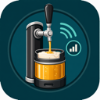

# PerfectDraft Taproom for Home Assistant

<p align="center">
  
</p>

PerfectDraft Taproom is a Home Assistant custom integration for the [PerfectDraft Pro](https://www.perfectdraft.com/) beer dispenser. Monitor your keg's temperature, remaining volume, pour history, beer catalogue details, shop stock signals, and more — right from your HA dashboard.

## Attribution

PerfectDraft Taproom is based on the original PerfectDraft Pro Home Assistant integration by [Falkvinge](https://github.com/Falkvinge/hassio-integration-perfectdraft-pro). Thanks to the original project for the HACS packaging, setup flow, and baseline PerfectDraft API work.

## Sensors

| Sensor | Description | Unit |
|--------|-------------|------|
| Temperature | Current beer temperature | °C |
| Keg Remaining | Beer left in the keg | % |
| Pints Remaining | Beer left in the keg | pt |
| Keg Freshness | Days remaining until 30-day freshness expires | days |
| Active Keg Inserted | Server-reported keg insertion timestamp | timestamp |
| Keg Age | Days since the active keg was inserted | days |
| Beer | Active beer name from the local catalogue lookup, with website beer details exposed as attributes | — |
| Favorite Beers | Diagnostic count of favourite beers from the PerfectDraft account, disabled by default | — |
| Favorite Beer 1-10 | Diagnostic favourite beer slots with catalogue attributes, disabled by default | — |
| Keg Volume | Remaining keg volume from the machine | L |
| Keg Pressure | Current keg pressure from the machine | mbar |
| Target Temperature | Configured beer target temperature | °C |
| Connection | Machine connectivity status | — |
| Door | Door open/closed state | — |
| Pours | Number of pours since keg was loaded | — |
| Last Pour | Volume of the most recent pour | mL |
| Last Pour Duration | Duration of the most recent pour, disabled by default | ms |
| Time to Target Temperature | Estimated cooling/heating time, with a `formatted_duration` attribute, disabled by default | s |
| Mode | Current operating mode (standard, eco, etc.) | — |
| Firmware | Machine firmware version (disabled by default) | — |
| Active Keg Product ID | PerfectDraft API product ID until catalogue lookup is implemented | — |
| Keg Type | API keg type, disabled by default | — |
| Pressure Setpoint | Configured pressure setpoint, disabled by default | mbar |
| Boost | Boost setting, disabled by default | — |
| Eco Temperature | Eco mode target temperature, disabled by default | °C |
| Volume Threshold | Configured low-volume threshold, disabled by default | L |

## Controls

The integration exposes controls for documented machine settings that are also visible as current setting values:

| Control | Description |
|---------|-------------|
| Target Temperature | Number entity constrained to the machine-reported temperature range, with 0.1 °C steps |
| Eco Temperature | Number entity constrained to the machine-reported temperature range, with 0.1 °C steps |
| Mode | Select entity using the documented mode options |
| Volume Threshold | Select entity using the documented threshold values |
| Eco Mode | Switch entity backed by the documented `mode` value (`eco`/`standard`) |
| Apply Ideal Temperature | Button that sets the machine target temperature to the current beer's ideal serving temperature |
| Add Current Beer To Favorites | Button that adds the current keg to the PerfectDraft account favourites when it is not already a favourite |
| Update Favorites | Diagnostic button that refreshes account favourites from the API |
| Refresh Beer Metadata | Diagnostic button that refreshes one eligible active/favourite product page |
| Discover New Beers | Diagnostic button that refreshes the curated PerfectDraft keg range |

Pressure settings are intentionally not exposed as controls.
The machine's Boost status is exposed as a read-only sensor. A writable Boost control is not exposed because the live PerfectDraft backend rejects both known Boost write shapes for this machine/API.

## Installation

### Via HACS (recommended)

1. Open HACS in Home Assistant
2. Click the three-dot menu > **Custom repositories**
3. Add this repository URL and select **Integration** as the category
4. Search for "PerfectDraft Taproom" and install
5. Restart Home Assistant

### Manual

1. Copy the `custom_components/perfectdraft` folder to your HA `config/custom_components/` directory
2. Restart Home Assistant

## Setup

### Step 1: Credentials

Go to **Settings > Devices & Services > Add Integration > PerfectDraft Taproom** and enter your PerfectDraft app email and password.

### Step 2: Verification Token

The integration needs a one-time verification token from PerfectDraft's website. This step looks more technical than it actually is — it takes about 30 seconds:

1. Open [perfectdraft.com/en-gb/customer/account/login](https://www.perfectdraft.com/en-gb/customer/account/login) in your browser (Chrome, Firefox, Edge, etc.) — you do **not** need to log in on this page, just open it
2. Press **F12** to open Developer Tools, then click the **Console** tab
3. Paste this command and press **Enter**:

```javascript
grecaptcha.enterprise.execute('6LcZQiUoAAAAAAO3JUjLiT470c-pNXbWyepuvMtV', {action: 'Magento/login'}).then(t => console.log(t))
```

4. A long string of text will appear in the console — that's your token
5. Select it, copy it, and paste it into the Home Assistant setup dialog
6. Click **Submit** within 2 minutes (the token expires)

That's it! The integration will authenticate and start polling your PerfectDraft Pro. Token refresh is automatic — you should not need to repeat this step. If the session does eventually expire, Home Assistant will prompt you to re-authenticate. (This is a new integration, so the exact session lifespan is still being determined — it's at least 30 days and may well be indefinite.)

### Step 3: Configure polling

After setup, you can adjust the polling interval in the integration's options. Default is 15 minutes; minimum is 1 minute.

## How It Works

The integration communicates with PerfectDraft's cloud API to read your machine's telemetry data. Token refresh is handled automatically via AWS Cognito — no reCAPTCHA needed after the initial setup.

This fork also reads the documented `perfectdraft_keg_active_read` API group. That exposes the active keg resource ID and server-side insertion timestamp, which is more reliable than inferring keg freshness from pour count and volume alone.

Beer metadata is resolved from a local catalogue lookup generated from the public PerfectDraft website's product index and product-page metadata. The official `/api/products/{id}` endpoint currently returns only the API product ID, so the local catalogue is the bridge between the machine's active keg ID and human-readable beer details. The active Beer sensor and favourite beer diagnostic sensors expose the website catalogue fields as entity attributes.

The Beer sensor also maintains a small local shop-data cache for the active keg and favourite kegs. Product pages are refreshed slowly: the active beer is eligible every 12 hours, favourites every 24 hours, and only one stale page is fetched per coordinator cycle with at least 60 seconds between product-page requests. Cached attributes include product image URL, food pairings, short description, price, price per pint, stock state, back-in-stock flag, review count, and shop refresh time.

On startup, the integration seeds a local persisted catalogue from the shipped Python catalogue. Runtime lookups use that local catalogue, so user-local entries, manual corrections, and scraped shop data survive restarts without editing code. Runtime shop data is only fetched for the beer currently installed in the machine and beers marked as favourites in the PerfectDraft app. To track pricing or stock for another beer, add it to your favourites in the PerfectDraft app. Full catalogue discovery is handled separately by the maintainer crawler, not by every Home Assistant install.

The Available Beers diagnostic sensor reads the current keg count from the curated PerfectDraft Kegs page. Its attributes are beer names, with each value set to `In Stock`, `Out of Stock`, or `Unknown`.

The Catalogue Job diagnostic sensor shows progress for manual metadata, favourites, and discovery buttons. Its state is the current job status, and attributes include job type, current item, processed/total count, percent, timestamps, and last error where applicable.

If a new keg appears before the shipped catalogue knows about it, use the `perfectdraft.set_local_beer` service to create a local catalogue entry for the active keg/product ID. Ideal beer temperature can come from the local catalogue, cached shop data, or a local manual override. Use the Ideal Beer Temperature number entity or the `perfectdraft.set_ideal_temperature` service to set an override for the current beer. The Apply Ideal Temperature button sets the machine target temperature to the beer's ideal temperature and is unavailable when no ideal temperature is known.

Catalogue maintenance is intentionally separate from Home Assistant runtime. Developers can run `scripts/crawl_catalogue.py --discover-only` to discover product URLs from the sitemap, or run the same script without `--discover-only` to crawl pages slowly and write `catalogue-crawl.json` for review before updating the static catalogue.

The maintainer crawler also keeps `catalogue-history.json`. That history merges the shipped Python catalogue, previous crawl data, and the current crawl so beers that disappear from the website are retained as retired products instead of being lost. It also records likely old-ID to new-ID aliases when stable identifiers such as SKU, GTIN, product code, or name/brewery match a current product. Use `scripts/crawl_catalogue.py --python-output catalogue-review.py` to generate a reviewable Python catalogue snapshot from that history before manually updating `custom_components/perfectdraft/catalogue.py`.

For the full technical story of how this integration was reverse-engineered, see [DISCOVERY.md](DISCOVERY.md).
